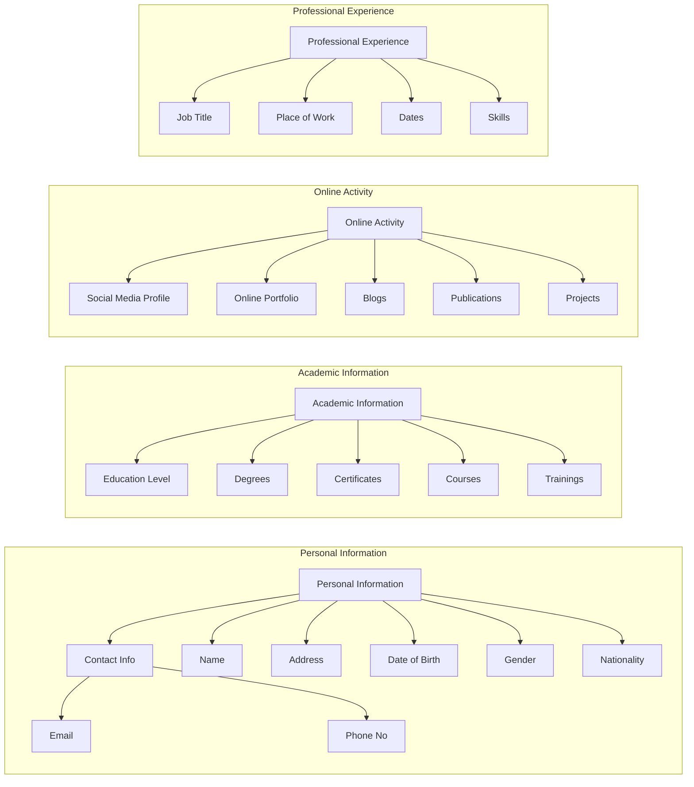
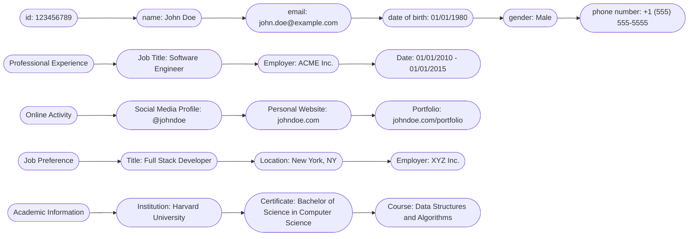
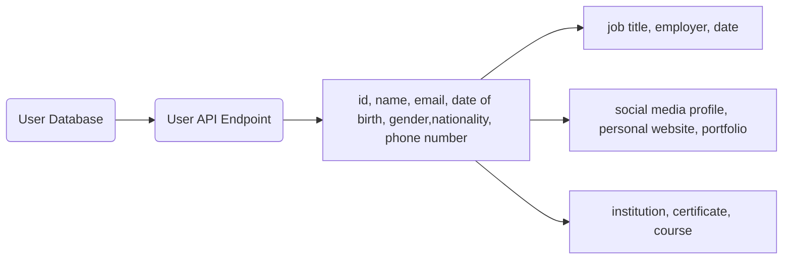

```mermaid
graph LR
subgraph Personal Information
PersonInfo[Personal Information]
Name[Name]
Contact[Contact Info]
Email[Email]
Phone[Phone No]
Address[Address]
DOB[Date of Birth]
Gender[Gender]
Nationality[Nationality]
end
subgraph Academic Information
AcadInfo[Academic Information]
Education[Education Level]
Degrees[Degrees]
Certificates[Certificates]
Courses[Courses]
Trainings[Trainings]
end
subgraph Online Activity
OnlineAct[Online Activity]
SocialMedia[Social Media Profile]
Portfolio[Online Portfolio]
Blogs[Blogs]
Publications[Publications]
Projects[Projects]
end
subgraph Professional Experience
ProfExp[Professional Experience]
JobTitle[Job Title]
PlaceOfWork[Place of Work]
Dates[Dates]
Skills[Skills]
end
PersonInfo-->Contact
PersonInfo-->Name
Contact-->Email
Contact-->Phone
PersonInfo-->Address
PersonInfo-->DOB
PersonInfo-->Gender
PersonInfo-->Nationality
AcadInfo-->Education
AcadInfo-->Degrees
AcadInfo-->Certificates
AcadInfo-->Courses
AcadInfo-->Trainings
OnlineAct-->SocialMedia
OnlineAct-->Portfolio
OnlineAct-->Blogs
OnlineAct-->Publications
OnlineAct-->Projects
ProfExp-->JobTitle
ProfExp-->PlaceOfWork
ProfExp-->Dates
ProfExp-->Skills
```

```mermaid
graph LR
id(["id: 123456789"])
name(["name: John Doe"])
email(["email: john.doe@example.com"])
dob(["date of birth: 01/01/1980"])
gender(["gender: Male"])
phone(["phone number: +1 (555) 555-5555"])

professional(["Professional Experience"])
jobtitle(["Job Title: Software Engineer"])
employer(["Employer: ACME Inc."])
date(["Date: 01/01/2010 - 01/01/2015"])

online(["Online Activity"])
social(["Social Media Profile: @johndoe"])
website(["Personal Website: johndoe.com"])
portfolio(["Portfolio: johndoe.com/portfolio"])

jobpref(["Job Preference"])
jtitle(["Title: Full Stack Developer"])
location(["Location: New York, NY"])
employerpref(["Employer: XYZ Inc."])

academic(["Academic Information"])
institution(["Institution: Harvard University"])
certificate(["Certificate: Bachelor of Science in Computer Science"])
course(["Course: Data Structures and Algorithms"])

id --> name
name --> email
email --> dob
dob --> gender
gender --> phone

professional --> jobtitle
jobtitle --> employer
employer --> date

online --> social
social --> website
website --> portfolio

jobpref --> jtitle
jtitle --> location
location --> employerpref

academic --> institution
institution --> certificate
certificate --> course
```

```mermaid
graph LR
userdb(User Database)
userendpoint(User API Endpoint)
userentity(User Entity)
professionalentity(Professional Experience Entity)
onlineentity(Online Activity Entity)

academentity(Academic Information Entity)

userdb --> userendpoint
userendpoint --> userentity
userentity --> professionalentity
userentity --> onlineentity

userentity --> academentity

userentity["id, name, email, date of birth, gender,nationality, phone number"]
professionalentity["job title, employer, date"]
onlineentity["social media profile, personal website, portfolio"]

academentity["institution, certificate, course"]
```
